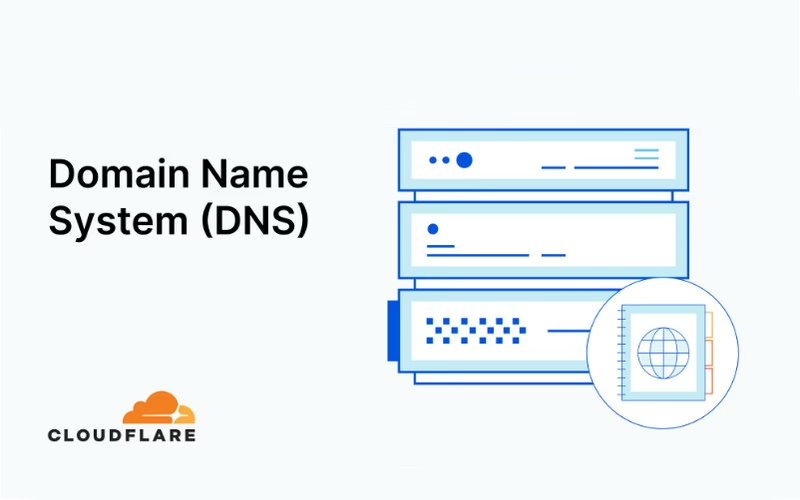

# 1. Giới thiệu về DNS

____

# Mục lục


- [1. Giới thiệu về DNS](#1-giới-thiệu-về-dns)
- [Mục lục](#mục-lục)
- [Nội dung](#nội-dung)
    - [1.1 DNS là gì?](#11-dns-là-gì)
    - [1.2 Vai trò, chức năng của DNS](#12-vai-trò-chức-năng-của-dns)
    - [1.3 Cách thức hoạt động của DNS](#13-cách-thức-hoạt-động-của-dns)
    - [1.4 Những máy chủ DNS tốt nhất thị trường hiện nay](#14-những-máy-chủ-dns-tốt-nhất-thị-trường-hiện-nay)
    - [1.4 Kết luận](#14-kết-luận)
    - [Các loại query DNS.](#các-loại-query-dns)
    - [1.5 cách tìm ip của domain dantri.vn bằng command trong linux ](#15-cách-tìm-ip-của-domain-dantrivn-bằng-command-trong-linux-)

____

# <a name="content">Nội dung</a>

### <a name="what-is">1.1 DNS là gì?</a>

- DNS viết tắt của Domain Name System có nghĩa là hệ thống phân giải tên miền. DNS là hệ thống cho phép thiết lập tương ứng giữa địa chỉ IP và tên miền trên Internet.

    

- Thế nào là DNS?

    

### <a name="whyfeature">1.2 Vai trò, chức năng của DNS</a>

- DNS đóng vai trò `như một “biên dịch viên” giữa tên miền và địa chỉ IP`. Tên miền là chuỗi ký tự dễ nhớ, trong khi địa chỉ IP là chuỗi số khó nhớ. DNS `giúp chuyển đổi tên miền thành địa chỉ IP`, từ đó giúp máy tính có thể truy cập vào các trang web trên internet.

- Mỗi máy tính khi kết nối vào Internet sẽ được gán cho 1 địa chỉ IP (Ví dụ: 1414.1158.62462) riêng biệt và không trùng lẫn với bất kỳ máy tính nào khác trên thế giới. Cũng giống như vậy đối với website cũng có địa chỉ IP riêng biệt của website đó.

    

- Tuy nhiên, mỗi website đề có một địa chỉ IP là các con số khá dài và khó nhớ khiến bạn không thể nhớ rõ con số IP đó.

**Ví dụ:**
```
Địa chỉ IP là 103.200.21.192 dẫn đến website Vietnix thay vì gõ vietnix.vn trên thanh tìm kiếm. 
Lúc này là lúc DNS “trổ tài chuyển đổi” (ánh xạ) dãy số địa chỉ IP thành những ký tự thân thiện hơn. 
Chính vì nhờ có giao thức DNS nên bạn không cần phải nhớ địa chỉ IP để vào website Vietnix mà chỉ cần nhớ vietnix.vn là được.
```

- Nói cách khác, `DNS` cũng giống như một danh bạ điện thoại dành riêng cho Internet. Nếu bạn biết tên của một người nhưng không biết số điện thoại hay ngược lại, bạn có thể tham khảo trong sổ danh bạ dễ dàng.

### <a name="How it works">1.3 Cách thức hoạt động của DNS</a>

- Khi người dùng truy cập một website, máy tính sẽ gửi yêu cầu đến máy chủ DNS cục bộ để tìm địa chỉ IP của website đó. Máy chủ DNS cục bộ sẽ kiểm tra cơ sở dữ liệu của mình xem có chứa địa chỉ IP của website hay không. Nếu có, sẽ trả về địa chỉ IP cho máy tính của người dùng.
- Quá trình phân giải DNS bao gồm chuyển đổi tên máy chủ (chẳng hạn như www.example.com) thành địa chỉ IP thân thiện với máy tính (chẳng hạn như 192.168.1.1). Một địa chỉ IP được cung cấp cho mỗi thiết bị trên Internet và địa chỉ đó là cần thiết để tìm thiết bị. Internet phù hợp. Giống như một địa chỉ đường phố được sử dụng để tìm một ngôi nhà cụ thể.
- Khi người dùng muốn tải một trang web, một bản dịch phải xảy ra giữa những gì người dùng nhập vào trình duyệt web của họ (example.com) và địa chỉ thân thiện với máy cần thiết để định vị trang web example.com.
- Nếu máy chủ DNS cục bộ không có địa chỉ IP của website, nó sẽ hỏi máy chủ DNS gốc. Máy chủ DNS gốc sẽ trả về địa chỉ IP của máy chủ DNS cấp cao nhất cho website.
- Máy chủ DNS cấp cao nhất sẽ trả về địa chỉ IP của máy chủ DNS quản lý website. Máy chủ DNS quản lý sẽ trả về địa chỉ IP của trang web cho máy chủ DNS cục bộ.
- Cuối cùng, máy chủ DNS cục bộ sẽ trả về địa chỉ IP của trang web cho máy tính của người dùng. Máy tính của người dùng sẽ sử dụng địa chỉ IP này để kết nối với website.

### <a name="Các máy chủ DNS">1.4 Những máy chủ DNS tốt nhất thị trường hiện nay</a>

- Việc chọn máy chủ DNS phù hợp và tốt nhất phụ thuộc vào nhiều yếu tố, bao gồm tốc độ, độ tin cậy và sự phù hợp với khu vực địa lý của người dùng. Dưới đây là một số gợi ý về những máy chủ DNS tốt nhất hiện nay:

**Google Public DNS**

- Được quản lý bởi Google, Google Public DNS được coi là một trong những máy chủ DNS nhanh và đáng tin cậy nhất. Với tốc độ phản hồi nhanh và khả năng bảo mật cao, Google Public DNS là lựa chọn phổ biến của người dùng trên toàn thế giới.

- Địa chỉ DNS của Google: 8.8.8.8 và 8.8.4.4

**Cloudflare DNS**

- Với tốc độ phản hồi rất nhanh và sự bảo mật mạnh mẽ, Cloudflare DNS là một lựa chọn phù hợp cho người dùng cần sự đáng tin cậy và bảo mật cao. Điều đặc biệt của Cloudflare DNS là họ còn cung cấp các tính năng bảo vệ chống tấn công DDoS và giảm thiểu rủi ro từ phần mềm độc hại.

- Địa chỉ DNS của Cloudflare: 1.1.1.1 và 1.0.0.1


**OpenDNS**
- Được cung cấp bởi Cisco. OpenDNS là một máy chủ DNS nhanh, đáng tin cậy. Đặc biệt, nó cung cấp nhiều tính năng bảo mật cho người dùng, bao gồm chặn trang web độc hại, chặn spam và bảo vệ đối với các trang web phổ biến nhưng có khả năng tấn công.

- Địa chỉ DNS của OpenDNS: 208.67.222.222 và 208.67.220.220

**Quad9**

- Quad9 là một máy chủ DNS miễn phí, nhanh và đáng tin cậy được quản lý bởi tập đoàn phi lợi nhuận về bảo mật mạng. Quad9 cung cấp tính năng bảo mật cao và chặn trang web độc hại, với một danh sách đen được cập nhật liên tục về các trang web độc hại và phishing.

- Địa chỉ DNS của Quad9: 9.9.9.9 và 149.112.112.112

Ngoài ra, người dùng cũng có thể sử dụng các công cụ kiểm tra máy chủ DNS như DNSPerf hoặc DNS Benchmark để tìm kiếm và chọn lựa các máy chủ DNS phù hợp nhất cho nhu cầu của mình.



### <a>1.4 Kết luận</a>
  - `DNS Server` là một phần không thể thiếu trong Internet và các hệ thống mạng. Bằng cách hiểu rõ về máy chủ DNS, bạn có thể dễ dàng cấu hình và bảo trì máy chủ DNS của riêng mình một cách hiệu quả và an toàn. Hy vọng bài viết này đã giúp bạn có cái nhìn tổng quan và hiểu rõ hơn về DNS Server. Nếu còn những thắc mắc cần giải đáp hay cần bổ sung kiến thức về DNS hãy trở lại với SunCloud.vn để được giải đáp sớm nhất nhất nhé.

### <a>Các loại query DNS.</a>

- DNS (Domain Name System) là một hệ thống quản lý các tên miền và biến đổi chúng thành địa chỉ IP tương ứng. 

**Dưới đây là một số loại truy vấn DNS phổ biến:**

1. **Truy vấn A (Address Record)**: Truy vấn A được sử dụng để tìm kiếm địa chỉ IPv4 của một tên miền cụ thể.

2. **Truy vấn AAAA (IPv6 Address Record)**: Tương tự như truy vấn A, nhưng sử dụng để tìm kiếm địa chỉ IPv6 của một tên miền.

3. **Truy vấn CNAME (Canonical Name Record)**: Truy vấn này được sử dụng để tạo một bản ghi tên miền phụ (alias) cho một tên miền chính.

4. **Truy vấn MX (Mail Exchange Record)**: Sử dụng để tìm kiếm máy chủ thư điện tử (mail server) cho một tên miền nhất định.

5. **Truy vấn NS (Name Server Record)**: Truy vấn NS được sử dụng để tìm kiếm thông tin về máy chủ tên miền (name server) cho một tên miền cụ thể.

6. **Truy vấn PTR (Pointer Record)**: Truy vấn này được sử dụng để tìm kiếm tên miền chính (domain name) cho một địa chỉ IP cụ thể.

7. **Truy vấn SOA (Start of Authority Record)**: Truy vấn SOA cung cấp thông tin về máy chủ tên miền gốc (root domain) cho một tên miền nhất định.

8. **Truy vấn TXT (Text Record)**: Truy vấn này cho phép lưu trữ các dữ liệu văn bản tùy chỉnh trong bản ghi DNS của một tên miền.

Các loại truy vấn DNS này được sử dụng để đáp ứng các yêu cầu khác nhau từ các máy khách trên Internet, giúp hệ thống DNS chuyển đổi giữa các tên miền và địa chỉ IP một cách hiệu quả.

### <a>1.5 cách tìm ip của domain dantri.vn bằng command trong linux </a>

-Bạn có thể sử dụng lệnh `dig` hoặc `nslookup` để tìm địa chỉ IP của tên miền "dantri.vn" trong Linux. Dưới đây là cách thực hiện bằng cả hai lệnh:

    ###Sử dụng lệnh `dig`:###
    ```bash
    dig +short dantri.vn
    ```

    ### Sử dụng lệnh `nslookup`:##
    ```bash
    nslookup dantri.vn
    ```

Kết quả sẽ hiển thị một hoặc nhiều địa chỉ IP liên quan đến tên miền "dantri.vn". Địa chỉ IP được liệt kê thường là các máy chủ web hoặc máy chủ DNS của tên miền đó.
